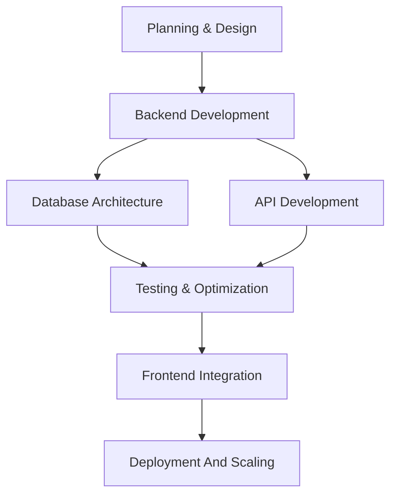

<div align="center">

Jambo! I'm  Suleiman Msaba
**Software Engineer / Data Analytics & Full-Stack Developer**

<br>

[](https://your-portfolio.com)
[](https://linkedin.com/in/suleiman-msaba)
[](mailto:suleimanmsaba1@gmail.com)
[](https://github.com/sulemsaba)

---

</div>

##  About Me
I'm a passionate software engineer with expertise in building scalable, high-performance applications across the full stack. I thrive on solving complex problems and creating elegant, impactful solutions.

```python
class Developer:
    def __init__(self):
        self.name = "Suleiman Msaba"
        self.role = "Software Engineer"
        self.passion = "Building things that matter"
        self.focus = ["Backend Development", "Cloud Architecture", "System Design"]

    def current_mood(self):
        return "🚀 Building something awesome"
````

---

## 🛠️ Tech Stack

### **Languages & Platforms**

<div align="center">


</div>

### **Backend**

<div align="center">


</div>

### **Frontend**

<div align="center">


</div>

### **Databases**

<div align="center">


</div>

### **DevOps & Cloud**

<div align="center">


</div>

---


---

## 🌟 Featured Projects

### **Pdf Darker** 


```
Tech Stack: Python
```
<!--
---

### **Project Name 2 | ⚡ Performance Focused**

Description highlighting scalability, speed, or innovation.

```
Tech Stack: FastAPI, React, MongoDB, AWS
```
-->
---

##  Development Activity



---

##  Design Philosophy

> "Simplicity is the ultimate sophistication." – Leonardo da Vinci

* Maintainable
* Scalable
* User-Centric
* Secure

---

##  Let's Connect

<div align="center">

💼 Open to collaborations
📚 Always learning
🎯 Let’s build something amazing together

<br>

[](https://linkedin.com/in/suleiman-msaba)
[](mailto:suleimanmsaba1@gmail.com)

</div>

---

<div align="center">

*"First, solve the problem. Then, write the code." – John Johnson*

© 2026 Suleiman Msaba | Crafted with ❤️

</div>
